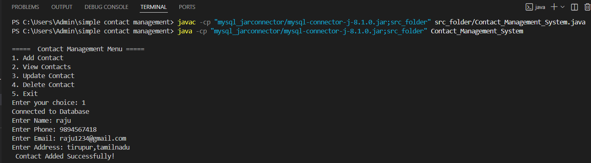
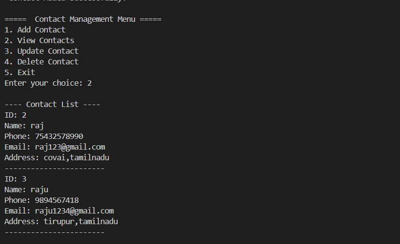
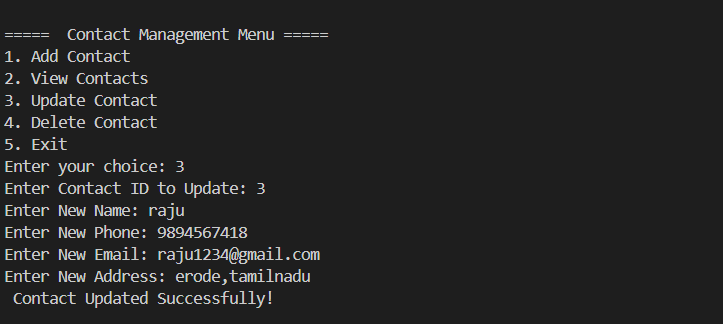
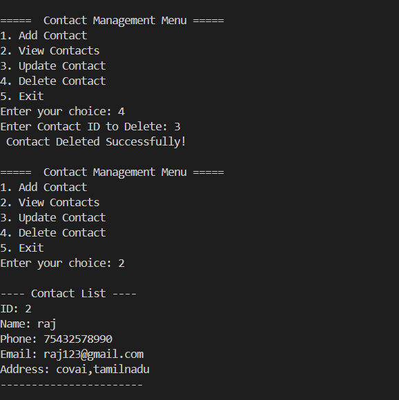

# 📇 Simple Contact Management System (MVP)

## 🚀 Project Overview

**Simple Contact Management System** is a console-based application developed using **Java and MySQL** that allows users to efficiently store, manage, and retrieve contact information.

This project was built as a **Minimum Viable Product (MVP)** to solve real-world problems related to manual contact storage and management.

It also represents my **product building experience** as an emerging Product Manager — from identifying a problem to developing and launching a working solution.

---

##  Problem Statement

Many people face challenges such as:

- Forgetting important contact details  
- Storing contacts in multiple places  
- Difficulty managing contacts efficiently  
- Lack of a simple centralized system  

This project solves these issues by providing an easy-to-use contact management solution.

---

##  Target Users

This system is designed for:

- Individuals who want to digitally store contacts  
- Users who frequently manage contact information  
- People needing quick access to emergency contacts  
- Anyone looking for a simple alternative to manual contact storage  

---

##  Why This Project Was Built

This project was developed as part of a **college requirement** to apply Java-MySQL integration to build a real-world management system.

As an aspiring Product Manager, I treated this as a **product development experience**:

- Identified a real user problem  
- Designed a practical solution  
- Built a working MVP  
- Released publicly via GitHub  

---

##  Key Features

- Add new contacts  
- View stored contacts  
- Update contact details  
- Delete contacts  
- MySQL database integration  
- Console-based user interface  

---

##  Tech Stack

- **Programming Language:** Java  
- **Database:** MySQL  
- **IDE:** VS Code  
- **Connector:** MySQL JDBC  

---

##  Application Workflow

1. User launches the system  
2. Menu options are displayed  
3. User selects an operation  
4. System performs CRUD operations  
5. Data stored securely in MySQL database  

---

##  Application Screenshots

### 🔹 Main Menu Interface

---

### 🔹 Add Contact Feature

---

### 🔹 View Contacts Feature

---

### 🔹 Update Contact Feature

---

### 🔹 Delete Contact Feature

---

##  Product Development Lifecycle

This project followed a simplified product lifecycle:

1. Problem Identification  
2. Solution Ideation  
3. MVP Development  
4. Testing & Debugging  
5. Public Launch on GitHub  

---

##  Challenges Faced

- Establishing Java-MySQL connectivity  
- Handling database exceptions  
- Designing efficient CRUD operations  
- Managing console-based UI flow  

---

##  Future Enhancements (Next Phase)

This MVP will be upgraded into a **Full Web Application**, including:

- Web-based UI interface  
- User authentication system  
- Search functionality  
- Cloud database integration  
- Mobile responsiveness  

---

##  Success Metrics (Product Perspective)

- Ability to store and retrieve contacts successfully  
- System performance during CRUD operations  
 

---

##  Product Management Learning

Through this project, I gained experience in:

- Problem-solution thinking  
- MVP development strategy  
- End-to-end product lifecycle  
- Technical and product collaboration  

---

##  GitHub Repository

Project Source Code:  
 (https://github.com/rishikesh306/contact-manager-mvp)

## 📄 Product Requirements Document (PRD)

The detailed **Product Requirements Document (PRD)** for this project is available in this repository.

 **View / Access PRD:**
[Click here to open PRD](https://github.com/rishikesh306/contact-manager-mvp)

⚠️ **Note:**
GitHub preview may not display the full PDF due to rendering limitations.
Please **download the file** to view the complete document properly.

---

##  Author

**RISHIKESH S**  
Aspiring Product Manager | Developer  

---

##  Project Status

**Completed — MVP Version**  
Next Phase: Web Application Development (In Progress)
